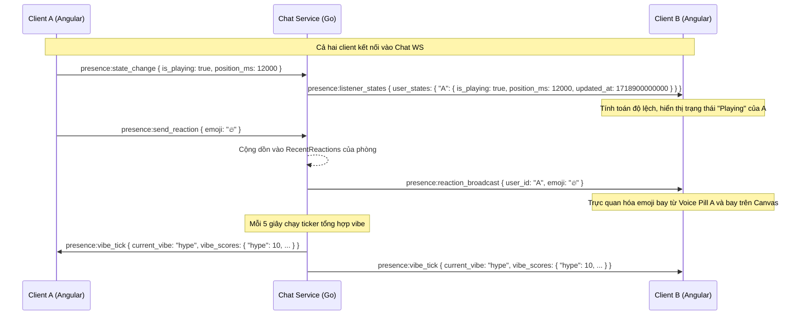

# Presence & Vibe (Phase 1) — Technical Design Specification

**Tạo:** 2026-06-21  
**Trạng thái:** Chờ User duyệt  
**Định dạng:** Technical Spec  

---

## 1. Mục tiêu & Phạm vi (Goal & Scope)

Mục tiêu của Pha 1 là làm cho phòng nghe nhạc trở nên **"sống"** bằng cách hiển thị rõ sự hiện diện, trạng thái nghe, các tương tác cảm xúc tức thì (Live Reactions) của người dùng, và tâm trạng chung (Vibe Meter) của căn phòng.

### Phạm vi tính năng:
1.  **Listener indicators**: Hiển thị trạng thái phát nhạc (đang phát, đang tạm dừng) trực tiếp trên Voice Pill của từng người dùng. Đồng thời, cảnh báo nếu một thành viên bị lệch (out of sync) với master playback quá 3 giây.
2.  **Live reactions**: Cho phép người dùng bắn các emoji (❤️, 🔥, 👏, 😮, 📚) bay trực tiếp trên màn hình, xuất hiện cả từ Voice Pill cá nhân lẫn bay lên từ góc màn hình.
3.  **Speaker/reaction pulse**: Bổ sung vòng sáng cho active speaker và hiệu ứng nảy (elastic bounce) kèm emoji bay lên cho các Voice Pill khi có reaction.
4.  **Room vibe meter**: Widget hiển thị tâm trạng căn phòng trên thang đo (chill, hype, study) dựa trên tổng hợp các reaction gần nhất từ server.

---

## 2. Kiến trúc & Dòng dữ liệu (Architecture & Data Flow)

Chúng ta chọn **Approach 1 (Unified Chat WebSocket)**. Cả tin nhắn chat, trạng thái nghe nhạc, các reaction tức thời và vibe của phòng sẽ đi chung trên một kết nối WebSocket duy nhất tại `/api/v1/rooms/:id/chat/ws`.



---

## 3. Giao thức WebSocket (WebSocket Protocol Expansion)

### A. Client -> Server (Gửi đi)

#### 1. Cập nhật trạng thái nghe (`presence:state_change`)
Gửi khi client bắt đầu phát, tạm dừng, tua nhạc, hoặc định kỳ (heartbeat) mỗi 5 giây.
```json
{
  "event": "presence:state_change",
  "room_id": "uuid-room-1234",
  "payload": {
    "is_playing": true,
    "position_ms": 42500
  }
}
```

#### 2. Gửi reaction tức thời (`presence:send_reaction`)
Gửi khi click vào nút quick reaction bar hoặc gửi emoji trong chat.
```json
{
  "event": "presence:send_reaction",
  "room_id": "uuid-room-1234",
  "payload": {
    "emoji": "🔥"
  }
}
```

---

### B. Server -> Client (Nhận về)

#### 1. Đồng bộ trạng thái phòng (`presence:listener_states`)
Broadcast tới toàn bộ phòng khi có sự thay đổi trạng thái của bất cứ listener nào.
```json
{
  "event": "presence:listener_states",
  "room_id": "uuid-room-1234",
  "payload": {
    "user_states": {
      "uuid-user-1": {
        "is_playing": true,
        "position_ms": 42500,
        "updated_at": 1718900010000
      },
      "uuid-user-2": {
        "is_playing": false,
        "position_ms": 10200,
        "updated_at": 1718900008000
      }
    }
  }
}
```

#### 2. Broadcast reaction (`presence:reaction_broadcast`)
Broadcast tức thời tới toàn phòng khi có người bắn reaction.
```json
{
  "event": "presence:reaction_broadcast",
  "room_id": "uuid-room-1234",
  "payload": {
    "user_id": "uuid-user-1",
    "emoji": "🔥"
  }
}
```

#### 3. Nhịp vibe định kỳ (`presence:vibe_tick`)
Broadcast định kỳ mỗi 5 giây chứa trạng thái vibe hiện tại của căn phòng.
```json
{
  "event": "presence:vibe_tick",
  "room_id": "uuid-room-1234",
  "payload": {
    "current_vibe": "hype",
    "vibe_scores": {
      "chill": 2,
      "hype": 18,
      "study": 0
    }
  }
}
```

---

## 4. Thiết kế Chi tiết Backend (Go)

### A. Tích hợp trong `chat-service`
1.  **Cấu trúc dữ liệu trong `ws_hub.go`**:
    *   `MemberState`: Lưu trạng thái play/pause, thời gian, và offset của user.
    *   `RoomPresence`: Struct an toàn thread (`sync.RWMutex`) chứa danh sách `MemberState` và map đếm `RecentReactions map[string]int`.
    *   `Hub`: Quản lý map `RoomPresences map[string]*RoomPresence`.

2.  **Đăng ký & Hủy**:
    *   Khi phòng được khởi tạo trên Hub: Khởi tạo `RoomPresence`.
    *   Khi client disconnect: Xóa trạng thái của member khỏi `RoomPresence.MemberStates`. Nếu phòng trống, dọn dẹp map.

3.  **Xử lý trong read pump (`handlers.go`)**:
    *   Trường hợp `presence:state_change`: Ghi đè vào `RoomPresence.MemberStates` của user đó, gán `updated_at = time.Now().UnixMilli()`. Broadcast tức thời `presence:listener_states`.
    *   Trường hợp `presence:send_reaction`: Tăng đếm emoji tương ứng trong `RecentReactions`, và broadcast tức thời `presence:reaction_broadcast`.

4.  **Vibe Ticker (Background Routine)**:
    *   Chạy định kỳ mỗi 5 giây.
    *   Tính vibe của từng phòng:
        *   Tổng hợp các đếm reaction.
        *   Xác định vibe trội: `hype` (nếu 🔥, 👏 chiếm đa số), `chill` (nếu ❤️, 😮 chiếm đa số), `study` (nếu 📚 chiếm đa số hoặc không có reaction nào).
    *   Thực hiện decay (giảm số đếm): Nhân toàn bộ counters với `0.3` (hoặc reset về 0) để vibe nguội dần nếu không còn tương tác mới.
    *   Broadcast `presence:vibe_tick`.

---

## 5. Thiết kế Chi tiết Frontend (Angular)

### A. Core Services
1.  **`ChatWsService`**:
    *   Mở rộng các case trong `handleMessage()` để nhận các sự kiện `presence:*`.
    *   Expose các stream: `listenerStates$`, `liveReaction$`, `roomVibe$`.
    *   Viết helper gửi sự kiện: `updatePresenceState()`, `sendLiveReaction()`.
2.  **Liên kết Player & Presence**:
    *   Lắng nghe thay đổi playback từ `PlayerEngineService` (play, pause, seek, heartbeat định kỳ). Khi có thay đổi, gọi `ChatWsService.updatePresenceState()`.

### B. UI Components
1.  **`VoicePillComponent`**:
    *   Nhận thông tin playback & sync của participant.
    *   **Trạng thái phát**: Overlay một icon play nhỏ (màu Teal) hoặc icon pause lên avatar.
    *   **Cảnh báo Unsynced**: Tính toán độ lệch:
        ```typescript
        const estimatedPosition = participant.isPlaying 
          ? participant.positionMs + (Date.now() - participant.updatedAt) 
          : participant.positionMs;
        const diff = Math.abs(estimatedPosition - masterPosition);
        const isUnsynced = diff > 3000; // lệch quá 3s
        ```
        Nếu `isUnsynced`, hiển thị viền nhấp nháy màu cam nhạt hoặc dấu chấm than cảnh báo lệch pha.
    *   **Reactions Pulse**: Lắng nghe stream `liveReaction$`. Nếu `user_id` khớp với pill, kích hoạt CSS class `.react-bounce` tạo hiệu ứng phóng to nảy đàn hồi (elastic scale).
    *   **Micro Floating Emoji**: Khi pill nhận reaction, tạo phần tử HTML emoji nổi lên trực tiếp từ avatar của pill, bay hướng lên và biến mất sau 1.5s.

2.  **`ReactionsCanvasComponent` [NEW]**:
    *   Một overlay trong suốt nằm trên khu vực Center Stage.
    *   Khi có reaction bay đến (từ `liveReaction$`), component thêm một node emoji có tọa độ X ngẫu nhiên (góc dưới bên phải).
    *   Sử dụng CSS Keyframes để làm emoji bay lên theo hình sin uốn lượn, đổi kích cỡ nhẹ và mờ dần trong 3s.
    *   *Reduced Motion support*: Nếu active prefers-reduced-motion, emoji chỉ hiển thị tĩnh tại chỗ và fade-out không di chuyển.

3.  **Quick Reactions Bar [NEW]**:
    *   Một thanh công cụ nhỏ dạng glassmorphism chứa 5 emoji (❤️, 🔥, 👏, 😮, 📚) nằm ngay trên thanh Player Bar.
    *   Bấm vào nút tương ứng sẽ kích hoạt `chatWs.sendLiveReaction(emoji)`.

4.  **`RoomVibeMeterComponent` [NEW]**:
    *   Nằm ở góc trên của giao diện Room.
    *   Hiển thị tâm trạng hiện tại kèm gradient và box-shadow breathing pulse tương ứng với vibe hiện tại.
    *   Hiển thị biểu đồ thanh ngang nhỏ thể hiện tỉ lệ phần trăm các loại reaction khi di chuột vào (popover).

---

## 6. Kế hoạch Kiểm thử & Xác thực (Verification Plan)

### A. Kiểm thử Tự động (Automated Tests)
*   **Backend Go Test**:
    *   Viết test trong `handlers_test.go` hoặc mock client gởi tin nhắn `presence:state_change` và `presence:send_reaction`. Xác thực Hub nhận diện đúng và broadcast lại chính xác các sự kiện.
    *   Kiểm tra logic ticker và decay của vibe: gởi reaction, sau 5s xác nhận nhận được `presence:vibe_tick` với vibe thích hợp, kiểm tra số đếm đã decay về đúng tỉ lệ.
*   **Frontend Angular Test**:
    *   Mock `ChatWsService` để giả lập nhận stream `presence:listener_states`.
    *   Test `VoicePillsComponent` tính toán đúng trạng thái `isUnsynced` khi nhận mock data lệch pha so với master player.
    *   Xác minh các class CSS hoạt động đúng khi kích hoạt bounce animation.

### B. Kiểm thử Thủ công (Manual Verification)
1.  Mở 2 tab trình duyệt ẩn danh, đăng nhập 2 user cùng vào 1 Room.
2.  **Test Listener indicators**: Nhấn Play/Pause ở Tab 1. Quan sát thấy voice pill của User 1 trên màn hình Tab 2 cập nhật đúng icon play/pause tức thời.
3.  **Test Out-of-sync**: Tắt mạng hoặc dừng player của User 2 trong khi bài hát của User 1 vẫn chạy. Xác nhận sau 3 giây, voice pill của User 2 xuất hiện cảnh báo Unsynced (orange warning).
4.  **Test Live reactions**: Bấm nút reaction (🔥) ở Tab 1. Xác nhận emoji bay lên từ góc phải màn hình của cả 2 tab và voice pill của User 1 đàn hồi đồng thời bay một micro-emoji 🔥 lên.
5.  **Test Vibe meter**: Bấm liên tiếp biểu tượng 🔥 ở cả hai tab. Xác nhận widget Vibe chuyển từ `chill` (hoặc `study`) sang `hype` với hiệu ứng màu sắc động tương ứng. Ngừng bấm và xác nhận vibe tự động nguội đi sau 10-15s.
